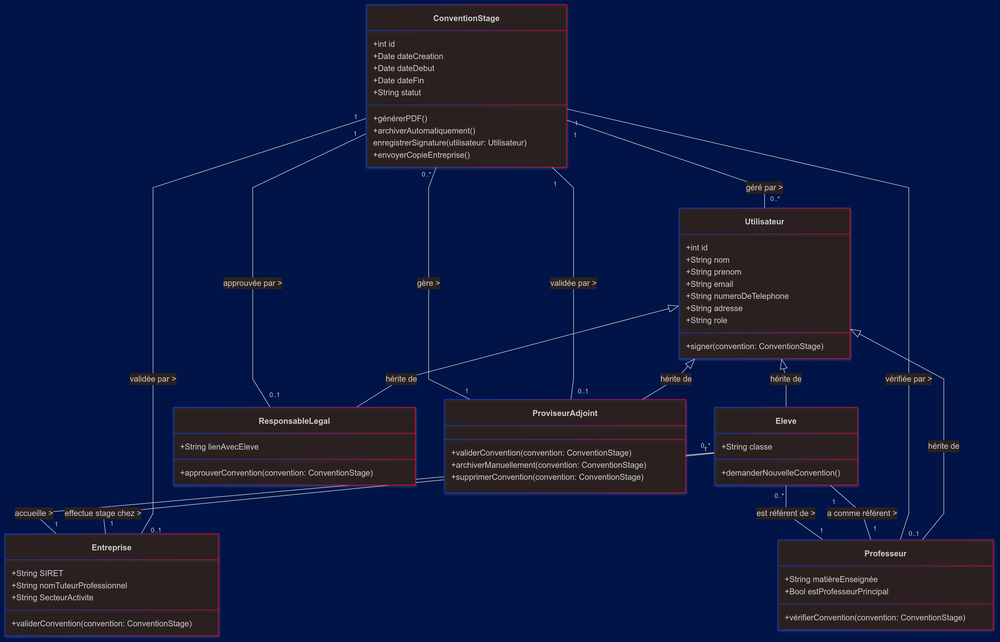
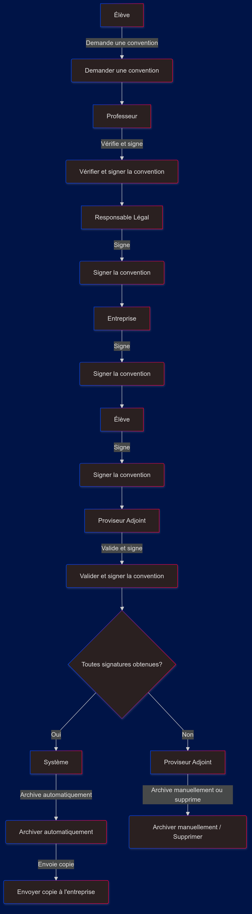

# Proposition de Projet : Digitalisation du Processus de Convention de Stage

- [Proposition de Projet : Digitalisation du Processus de Convention de Stage](#proposition-de-projet--digitalisation-du-processus-de-convention-de-stage)
  - [Contexte](#contexte)
  - [Objectif du Projet](#objectif-du-projet)
  - [Développeur du Projet](#développeur-du-projet)
  - [Proposition de Solution](#proposition-de-solution)
  - [Technologies Proposées](#technologies-proposées)
  - [Conformité RGPD](#conformité-rgpd)
  - [Diagrammes et UML](#diagrammes-et-uml)
    - [:warning: **NOTE IMPORTANTE:**](#warning-note-importante)
    - [Diagramme de Classes](#diagramme-de-classes)
      - [Explication du Diagramme de Classes](#explication-du-diagramme-de-classes)
        - [1. ConventionStage](#1-conventionstage)
        - [2. Utilisateur](#2-utilisateur)
        - [3. Élève](#3-élève)
        - [4. Entreprise](#4-entreprise)
        - [5. Responsable Légal](#5-responsable-légal)
        - [6. Professeur](#6-professeur)
        - [7. ProviseurAdjoint](#7-proviseuradjoint)
        - [Relations entre les Classes](#relations-entre-les-classes)
        - [Conclusion](#conclusion)
    - [Diagramme de Cas d'Utilisation (Flux de Signature)](#diagramme-de-cas-dutilisation-flux-de-signature)
      - [Explication du Diagramme de Cas d'Utilisation](#explication-du-diagramme-de-cas-dutilisation)
        - [1. Initialisation par l'Élève](#1-initialisation-par-lélève)
        - [2. Validation par le Professeur](#2-validation-par-le-professeur)
        - [3. Approbation par le Responsable Légal](#3-approbation-par-le-responsable-légal)
        - [4. Validation de l'Entreprise](#4-validation-de-lentreprise)
        - [5. Contre-signature par l'Élève](#5-contre-signature-par-lélève)
        - [6. Validation Finale par le Proviseur Adjoint](#6-validation-finale-par-le-proviseur-adjoint)
      - [Scénarios Possibles](#scénarios-possibles)
        - [Flux Nominal](#flux-nominal)
        - [Flux Alternatif](#flux-alternatif)
      - [Principes Clés](#principes-clés)
      - [Conclusion](#conclusion-1)
  - [Timeline du Projet](#timeline-du-projet)
    - [Minimum Valuate Project (Mars 2025)](#minimum-valuate-project-mars-2025)
    - [Proposition des options supplémentaires avec date potentielle](#proposition-des-options-supplémentaires-avec-date-potentielle)
  - [Modalités d'échange proposée](#modalités-déchange-proposée)
  - [Conclusion](#conclusion-2)

## Contexte
Le lycée Jean Monnet souhaite moderniser et simplifier le processus de gestion des conventions de stage. Actuellement, ce processus est en grande partie manuel, ce qui entraîne des inefficacités et des risques d'erreurs. La digitalisation permettra d'améliorer la transparence, la traçabilité, l'accessibilité des documents et surtout la rapidité du processus.

## Objectif du Projet
Développer une solution numérique pour la création de la convention, la signature électronique et l'archivage des conventions de stage, facilitant ainsi le travail des élèves, des entreprises et des responsables légaux.

## Développeur du Projet
- **Anne-Cécile Besse**

## Proposition de Solution
La solution proposée comprend les fonctionnalités suivantes :
- **Génération de conventions dématérialisées** : Création facile de documents conformes.
- **Signature électronique** : Mise en place d'un processus sécurisé pour la signature des conventions par toutes les parties.
- **Interface multiplateforme** : Accessible sur web et mobile.
- **Intégration avec Pronote** : Synchronisation avec le système existant pour une gestion fluide des données.
- **Archivage numérique** : Conservation sécurisée des documents signés via une base de donnée intégrée ou via Pronote

## Technologies Proposées
- **Frontend** : *Svelte* - Pour une interface utilisateur réactive et moderne.
- **Backend** : *FastAPI* - Pour des performances optimales et une conformité RGPD.
- **Signature électronique** : *DSS* (Digital Signature Service) - Conforme aux normes européennes.
- **Base de données** : *Supabase* - Pour une gestion simplifiée des données et de l'authentification SI non gérées par Pronote.
- **Multiplateforme** : *Flutter Web* - Pour une expérience utilisateur cohérente sur tous les appareils.

## Conformité RGPD

La solution doit impérativement respecter les exigences du RGPD. Voici comment cela sera assuré :

- **Collecte Minimale de Données :** Seules les données nécessaires à la création et à la gestion des conventions seront collectées.
- **Consentement Éclairé :** Les utilisateurs (élèves, parents, entreprises) devront donner leur consentement explicite avant toute collecte ou traitement de leurs données personnelles.
- **Sécurisation des Données :** Des mesures techniques et organisationnelles seront mises en place pour garantir la sécurité des données personnelles (cryptage, accès restreint).
- **Droit d'Accès et de Rectification :** Les utilisateurs auront le droit d'accéder à leurs données personnelles et de demander leur rectification si nécessaire.
- **Archivage Sécurisé :** Les documents signés seront archivés dans un environnement sécurisé, garantissant leur intégrité et leur confidentialité (Pronote ou ce projet)

## Diagrammes et UML

### :warning: **NOTE IMPORTANTE:**

Tous les diagrammes présentés ci-dessous sont susceptibles de changer en fonction des besoins et de l'évolution du projet. 

### Diagramme de Classes

#### Explication du Diagramme de Classes

Ce diagramme représente le système de gestion des conventions de stage, montrant les différents acteurs impliqués et leurs interactions. Voici une description des principales composantes :

##### 1. ConventionStage
- **Description** : Représente le document officiel qui formalise le stage entre l'élève, l'entreprise et l'établissement scolaire.
- **Attributs** :
  - **`id`** : Identifiant unique de la convention.
  - **`dateCreation`** : Date à laquelle la convention a été créée.
  - **`dateDebut`** : Date de début du stage.
  - **`dateFin`** : Date de fin du stage.
  - **`statut`** : Indique l'état actuel de la convention (ex. : en attente, signée).
- **Méthodes** :
  - **`générerPDF()`** : Crée un document PDF de la convention.
  - **`archiverAutomatiquement()`** : Archive automatiquement la convention une fois qu'elle a été signée par toutes les parties.
  - **`signerConvention(utilisateur: Utilisateur)`** : Enregistre la signature d'un utilisateur sur la convention.
  - **`envoyerCopieEntreprise()`** : Envoie automatiquement une copie à l'entreprise une fois la convention signée par tous.

##### 2. Utilisateur
- **Description** : Classe de base pour tous les utilisateurs du système.
- **Attributs** :
  - `id`, `nom`, `prenom`, `email`, `numeroDeTelephone`, `adresse`, `role`.
- **Méthodes** :
  - **`signer(convention: ConventionStage)`** : Permet à l'utilisateur de signer une convention.

##### 3. Élève
- **Description** : Représente l'étudiant qui doit réaliser un stage.
- **Attributs** :
  - **`classe`** : La classe de l'élève.
- **Méthodes** :
  - **`demanderNouvelleConvention()`** : Permet à l'élève de demander une nouvelle convention.

##### 4. Entreprise
- **Description** : Représente l'entreprise qui accueille l'élève en stage.
- **Attributs** :
  - **`SIRET`** : Numéro SIRET de l'entreprise.
  - **`nomTuteurProfessionnel`** : Nom du tuteur professionnel dans l'entreprise.
  - **`SecteurActivite`** : Secteur d'activité de l'entreprise.
- **Méthodes** :
  - **`validerConvention(convention: ConventionStage)`** : Permet à l'entreprise de valider la convention.

##### 5. Responsable Légal
- **Description** : Représente les parents ou tuteurs de l'élève.
- **Attributs** :
  - **`lienAvecEleve`** : Relation avec l'élève (parent, tuteur, etc.).
- **Méthodes** :
  - **`approuverConvention(convention: ConventionStage)`** : Permet au responsable légal d'approuver la convention.

##### 6. Professeur
- **Description** : Enseignant responsable du suivi des élèves.
- **Attributs** :
  - **`matièreEnseignée`** : Matière enseignée par le professeur.
  - **`estProfesseurPrincipal`** : Indique si c'est un professeur principal.
- **Méthodes** :
  - **`vérifierConvention(convention: ConventionStage)`** : Vérifie que la convention est correcte avant qu'elle ne soit signée.

##### 7. ProviseurAdjoint
- **Description** : Responsable de la validation finale et de la gestion des conventions.
- **Méthodes** :
  - **`validerConvention(convention: ConventionStage)`** : Valide la convention de stage.
  - **`archiverManuellement(convention: ConventionStage)`** : Archive manuellement une convention (ex. : abandonnée).
  - **`supprimerConvention(convention: ConventionStage)`** : Supprime une convention si nécessaire.

##### Relations entre les Classes
- Chaque convention est gérée par plusieurs utilisateurs (élèves, entreprises, professeurs, etc.).
- Un élève effectue son stage dans une entreprise et a un professeur référent.
- Une entreprise peut accueillir plusieurs élèves en stage.
- Un professeur peut être le référent de plusieurs élèves.
- Le proviseur adjoint gère toutes les conventions, pouvant les valider, archiver manuellement ou supprimer.

##### Conclusion
Ce diagramme illustre les interactions entre les différents acteurs dans le processus de gestion des conventions de stage, assurant un suivi complet depuis la demande initiale jusqu'à l'archivage, en passant par les étapes de validation et de signature.

### Diagramme de Cas d'Utilisation (Flux de Signature)

#### Explication du Diagramme de Cas d'Utilisation 

Ce diagramme illustre le processus complet de gestion des conventions de stage, depuis la demande initiale jusqu'à l'archivage final, en détaillant le parcours de signature par chaque intervenant.

##### 1. Initialisation par l'Élève
- **Action** : Demander une convention de stage
- **Responsabilité** : L'élève est à l'origine de la démarche
- **Objectif** : Formaliser son besoin de stage

##### 2. Validation par le Professeur
- **Action** : Vérifier et signer la convention
- **Responsabilité** : Contrôler la conformité de la convention
- **Critères** : 
  - Vérifier les informations de l'élève
  - S'assurer de la pertinence du stage
  - Apposer sa signature après validation

##### 3. Approbation par le Responsable Légal
- **Action** : Signer la convention
- **Responsabilité** : Donner son consentement parental
- **Objectifs** :
  - Confirmer les informations personnelles
  - Autoriser le stage de l'élève

##### 4. Validation de l'Entreprise
- **Action** : Signer la convention
- **Responsabilité** : Accepter officiellement l'accueil de l'élève
- **Critères** :
  - Compléter ses informations (SIRET, coordonnées)
  - Confirmer les conditions d'accueil du stagiaire

##### 5. Contre-signature par l'Élève
- **Action** : Signer la convention
- **Responsabilité** : Confirmer son engagement
- **Objectif** : Valider définitivement son projet de stage

##### 6. Validation Finale par le Proviseur Adjoint
- **Action** : Valider et signer la convention
- **Responsabilité** : Validation administrative ultime
- **Pouvoirs** :
  - Vérifier l'exhaustivité des signatures
  - Valider définitivement la convention

#### Scénarios Possibles

##### Flux Nominal
1. Toutes les signatures sont obtenues
2. Le système archive automatiquement la convention
3. Une copie est envoyée à l'entreprise

##### Flux Alternatif
- Si une étape de signature est incomplète pour diverses raisons (retrait de l'entreprise, refus de l'élève, etc)
- Le Proviseur Adjoint peut :
  - Archiver manuellement la convention
  - Supprimer la convention

#### Principes Clés
- **Séquentialité** : Chaque intervenant signe à son tour
- **Traçabilité** : Chaque signature est enregistrée
- **Flexibilité** : Possibilité de gérer les cas non conformes

#### Conclusion
Ce diagramme de flux représente un processus collaboratif et séquentiel, garantissant que chaque convention de stage est rigoureusement validée par tous les acteurs concernés.

## Timeline du Projet

### Minimum Valuate Project (Mars 2025)
- Génération de conventions basiques
- Processus de signature simple
- Processus d'envoi et de renvoi des conventions à chaque partis
- Interface web de base
- Intégration avec Pronote si possible
- Gestion de l'archivage

### Proposition des options supplémentaires avec date potentielle
- Juin 2025 : Amélioration du visuel
- Juillet 2025 + : 
  - Étendre le projet pour implémenter les rapports de stages
  - Notifications
  - Suivi de stage en temps réel

## Modalités d'échange proposée
- Réunions hebdomadaires de suivi (visioconférence)
- Démonstrations des nouvelles fonctionnalités sur demande (si applicables)
- [Journal de bord](journal_de_bord.md) pour un suivi des tâches en temps réel.
    (Ce lien mène à un exemple, pour le moment vide, du format du journal de bord que j'utiliserais.)

## Conclusion
Cette proposition vise à moderniser le processus de convention de stage, en offrant une solution numérique efficace, sécurisée et adaptée aux besoins des utilisateurs. Je suis convaincue que cette initiative améliorera considérablement l'expérience pour toutes les parties prenantes.

---

Pour toute question ou commentaire concernant cette proposition, n'hésitez pas à me contacter à cette adresse 9334@holbertonstudents.com ou via Slack.